# Terminal Package for Ultimate++

*Copyright © 2019-2020, [İsmail  Yılmaz](mailto:iylmz.iylmz@gmail.com)*

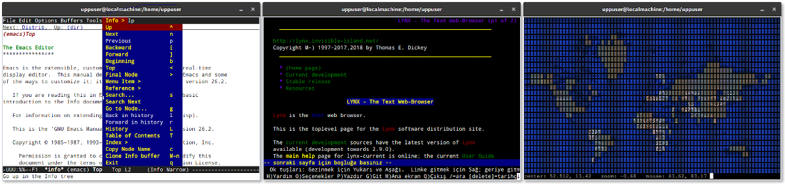

## Table of Contents

 1.  [Introduction](#introduction)
 2.  [Requirements](#requirements)
 3.  [Highlights](#highlights)
 4.  [Features](#features)
 5.  [Capabilities](#specs)
 6.  [Examples](#examples)
 7.  [To Do](#todo)
 8.  [Known Issues](#issues)
 9.  [Version](#version)
 10. [Acknowledgements](#acknowledgements)
 11. [License](#license)
 

## [Introduction](#introduction)

Terminal package is a flexible, easy-to-use yet powerful cross-platform virtual terminal emulation widget and library written in C/C++ for [Ultimate++](https://www.ultimatepp.org/).  

Terminal package is designed from the ground up with modularity and maintainability in mind, and it is not based on the existing terminal emulation libraries.

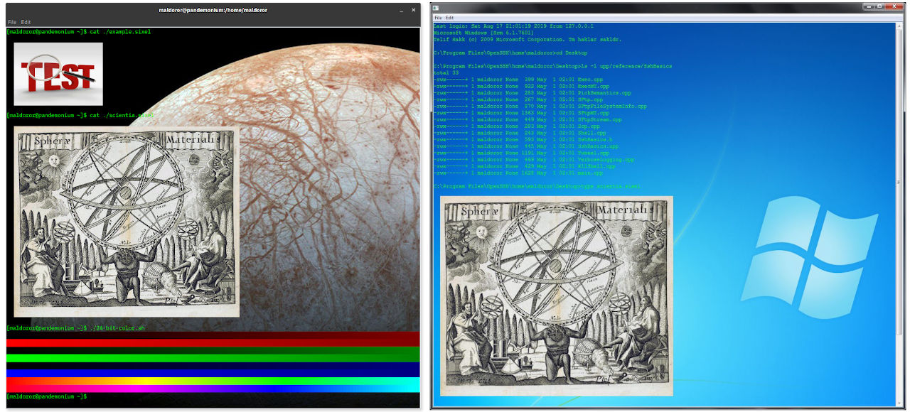

### Demo Videos
The four short videos below show the basic capabilities of Terminal package in general, and Terminal widget in particular, on various platforms. See also *Highlights*, *Features*, and *Examples* sections for more details.

#### On Linux
- A basic terminal example with sixel graphics, and mouse tracking support.
- Used apps and tools: Jexer text user interface (TUI), GNUPlot, Emacs, Nano, htop, ncurses demos.
- Link: https://vimeo.com/359241367

#### On Windows
- A basic SSH2 terminal example with sixel graphics, and mouse tracking support.
- Used apps and tools: Jexer text user interface.
- Link: https://vimeo.com/361556973

- A multithreaded SSH2 terminal splitter example, with sixel graphics and mouse tracking support.
- Used apps and tools: Jexer text user interface, htop, GNU nano, ncurses demos.
- Link: https://vimeo.com/362532208

#### On Turtle HTML-5 backend (in a web browser)
- A basic terminal example with sixel graphics, and mouse tracking support.
- Used apps and tools: Jexer text user interface.
- Link:https://vimeo.com/361558519

Note that the example code used in these videos can be found in the *Examples* section. 

## [Requirements](#requirements)

- Ultimate++ (ver. >= 2019.1)
- POSIX, Windows, or MacOS
- A decent enough C/C++ compiler that supports at least C++11. (GCC/CLANG/MinGW/Msc)
- Snacks & beer.

## [Highlights](#highlights)

- **Terminal package completely separates the virtual terminal from the pseudo-terminal process (pty)**.
As a result, Terminal package and its Terminal ctrl are not bound by any platform-specific pty implementation. Instead, they are decoupled, and an optional pty process class, PtyProcess, is provided with tha package as the default option. In this way, using the Terminal widget on any platform supported by Ultimate++, directly as a front-end for some other terminal based services, such as SSH or TELNET, etc., has become possible. This point is demonstrated with one of the provided  examples: While the PtyProcess is currently not available on Windows (it's a TODO), Terminal widget can be compiled, run, and used on Windows, or on other supported platforms, as an SSH terminal. (See the *Examples* section.)

- **Terminal package is designed with simplicity in mind.**
A fully-fledged terminal emulation requires less than 50 sLoC. In fact, the first basic example provided with the package is only a single .cpp file with 29 sLoC, and it can run complex/heavy applications with mouse tracking and embedded images support, such as [GNU Emacs](https://www.gnu.org/software/emacs/), [Lynx](https://lynx.browser.org/), [GNUPlot](http://www.gnuplot.info/), [tmux](https://github.com/tmux/tmux/wiki) or [mapscii](https://github.com/rastapasta/mapscii), an OpenStreetMap implementation for [xterm](https://invisible-island.net/xterm/) compatible virtual terminal emulator, or even [Jexer](https://jexer.sourceforge.io/), a java-based modern and slick text user interface (TUI) and windowing system for modern terminal emulators, with ease.

- **Terminal package combines simplicity with configurability.** 
Although it is easy to use, and requires very little coding, Terminal ctrl is by no means restrictive. It it highly configurable.

- **Terminal widget is a regular ctrl.**
It is derived from Upp::Ctrl, and is following the same basic rule: *Everthing belongs somewhere*. It supports most of the generic Ctrl methods where applicable or makes sense. Of course, If you are determined enough, you can even do some “interesting” things, such as adding Terminal instances to a TreeCtrl or ArrayCtrl. ;)

- **Terminal widget supports true color.**
Ultimate++ Terminal widget is a true color (24-bit color) virtual terminal emulator. It supports RGB, CMY, CMYK, and  indexed (256-color) palettes via SGR extended colors sequences. 

- **Terminal widget supports inline images.**
Terminal widget has a flexible infrastructure and support for inline images and image manipulation in general. It can handle [sixel graphics](https://en.wikipedia.org/wiki/Sixel?oldformat=true) with 4/16/256 colors, or high/true color.  It also supports JPG, PNG, BMP raster image formats, or raw RGB images via [iTerm2's inline images protocol](https://iterm2.com/documentation-images.html),  and [jexer image protocol](https://gitlab.com/klamonte/jexer/-/wiki_pages/jexer-images), a simple and useful wire protocol which allows terminals to display popular true color image formats. In fact, since the terminal widget uses the common raster decoding api of Ultimate++, theoretically it can display any raster image that has a registered decoder.  Terminal ctrl uses Upp::Display objects to display the embedded images. Client code can set the image display to one of the predefined display objects that'll process or manipulate the images before they are displayed (stretch/scale/colorize/flip/add text, etc., you name it), and the changes will immediately take place. Moreover, developers can create their own cell displays tailored for their specific needs. Terminal widget also supports an external image viewing mode, where the image data is handed to client code for rendering and external viewing.

- ***Everything belongs somewhere* rule runs through the heart of Terminal package.**
There are no manual memory allocations/deallocations, no new/delete pairs, and no smart/not-so-smart/shared pointers in the code; only the containers, and extensive application of the [RAII](https://www.wikiwand.com/en/Resource_acquisition_is_initialization) principle.

- **Terminal widget can also run inside a web browser such as Firefox and Chromium, or their derivatives.**
  Thanks to Ultimate++ team, it is possible to run U++ GUI applications from within a web browser that supports HTML-5 canvas and websockets. And Terminal package is no exception. Applications using Terminal ctrl can basically turn into a remote terminal that can be accessed via any decent web browser (even from a smartphone!) if compiled with the TURTLE flag. (See the *Examples* section).

- **Terminal package has a** [BSD 3-Clause](https://en.wikipedia.org/wiki/BSD_licenses?oldformat=true#3-clause_license_%28%22BSD_License_2.0%22,_%22Revised_BSD_License%22,_%22New_BSD_License%22,_or_%22Modified_BSD_License%22%29) **license**.

## [Features](#features)

- Supports whatever platform Ultimate++ supports. (Linux, Windows, MacOS).
- Supports VT52/VT1xx/VT2xx, partial VT4XX/5XX, and xterm emulation modes.
- Supports user configurable device conformance levels (1, 2, 3, 4, and 0 as VT52 emulation).
- Supports both 7-bits and 8-bits I/O.
- Supports Unicode/UTF8.
- Supports user configurable, legacy “g-set” (G0/G1/G2/G3), and related shifting functions (LS0/LS1/LS1R/LS2/LS2R/LS3/LS3R/SS2/SS3).
- Supports ANSI conformance levels.
- Supports scalable fonts. (The changes in font size and/or face immediately take place.)
- Supports various terminal state, device, and mode reports.
- Supports DEC VT52 graphics charset, VT1xx line-drawing charset, VT2xx multinational charset, and VT3xx technical charset.
- Supports VT52/VT1xx/VT2xx keyboard emulation with function keys.
- Supports UDK (DEC’s user-defined function keys feature).
- Supports user configurable blinking text and blink interval.
- Supports Display objects.
- Supports inline images with true color (sixel, jpeg, png, bmp, tiff, etc).
- Supports external handling of images.
- Supports ANSI + aixterm colors (16 colors palette).
- Supports true color (16 million colors).
- Supports extended colors sequences .
- Supports RGB, CMY, CMYK and indexed color palettes via extended color sequences.
- Supports xterm dynamic colors and color setting (dynamic ink/paper/selection colors).
- Supports rgb and older hash3, hash6, hash9, hash12 color text specifications.
- Supports background color erase (BCE).
- Supports transparency, i.e. allows background images, even animations. It's up to client code.
- Supports VT4xx rectangular area operations: copy, invert, fill. erase.
- Supports VT4xx rectangular area checksum calculation and reporting.
- Supports both DEC and ANSI style selective erases.
- Supports reverse wrap.
- Supports SGR overline attribute.
- Supports alternate screen buffer.
- Supports history/scrollback buffer.
- Has a user switchable scrollbar.
- Supports xterm style alternate scroll.
- Supports resize (and optional lazy resize to reduce flicker on network terminals such as SSH-based ones).
- Supports both immediate display refresh and delayed (buffered) display refresh.
- Supports xterm style mouse tracking: button, wheel, motion, focus in/out events.
- Supports a large portion of xterm's window ops (window reports and actions).
- Supports user configurable cursor styles (block, beam, underscore, blinking/steady).
- Supports cursor locking.
- Supports basic clipboard operations on texts, hyperlinks, and images.
- Supports basic drag and drop operations on texts, hyperlinks and images.
- Shows drag and drop animations (i.e thumbnails/samples of images, hyperlinks and plain texts)
- Supports rectangle selection.
- Supports bracketed paste mode.
- Supports [explicit hyperlinks.](https://gist.github.com/egmontkob/eb114294efbcd5adb1944c9f3cb5feda) (OSC 8)
- Has a predefined yet completely re-programmable context menu (right mouse button menu).
- Supports window titles.
- Supports bell notifications.
- Supports VT1xx LEDs.
- Supports size hint.
- Supports Ultimate++ style data serialization.
- Supports per-widget customization (i.e no global variables or properties are used).
- Includes a Terminal.usc file for TheIDE’s layout editor.

## [Technical Capabilities, Supported Sequences, Modes, and Extensions](#specs)

-  For more information on the technical capabilities of Ultimate++ Terminal widget, see [the technical specifications document](./Specs.md).
 
## [Examples](#examples)
As it is already noted above, one of the strengths of the Terminal Package is that it allows you to do more with less. The examples provided below are meant to illustrate this point. Five examples are provided with the package:

1. Basic terminal
2. Ssh terminal
3. Terminal in a web browser
4. Terminal splitter
5. Ssh terminal splitter

### Basic Terminal Example
This example demonstrates the basic usage of the Terminal widget and its interaction with the PtyProcess class. Creating an xterm-compatible virtual terminal emulator with inline images and mouse tracking support requires only 29 sLoC:	

```C++    	
#include <Terminal/Terminal.h>
#include <Terminal/PtyProcess.h>

using namespace Upp;

const char *nixshell = "/bin/bash";

struct TerminalExample : TopWindow {
	Terminal term;
	PtyProcess pty;
	
	TerminalExample()
	{
		SetRect(term.GetStdSize());  // 80 x 24 cells (scaled).
		Sizeable().Zoomable().CenterScreen().Add(term.SizePos());
		term.WhenBell   = [=]()         { BeepExclamation(); };
		term.WhenTitle  = [=](String s) { Title(s);          };
		term.WhenOutput = [=](String s) { pty.Write(s);      };
		term.WhenResize = [=]()         { pty.SetSize(term.GetPageSize()); };
		term.InlineImages().Hyperlinks().WindowOps();
		pty.Start(nixshell, Environment(), GetHomeDirectory());
		SetTimeCallback(-1, [=] ()
		{
			term.WriteUtf8(pty.Get());
			 if(!pty.IsRunning())
				Break();
		});
	}
};

GUI_APP_MAIN
{
	TerminalExample().Run();
}
```
Yup, that's all.

#### Screenshots
Jexer with sixel support, running on the basic terminal example. (Linux)
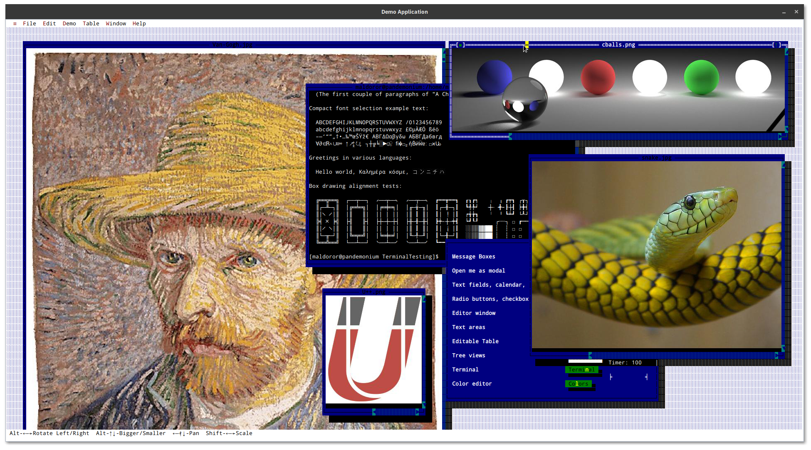

tmux/screen, running on the basic terminal example. (Linux)
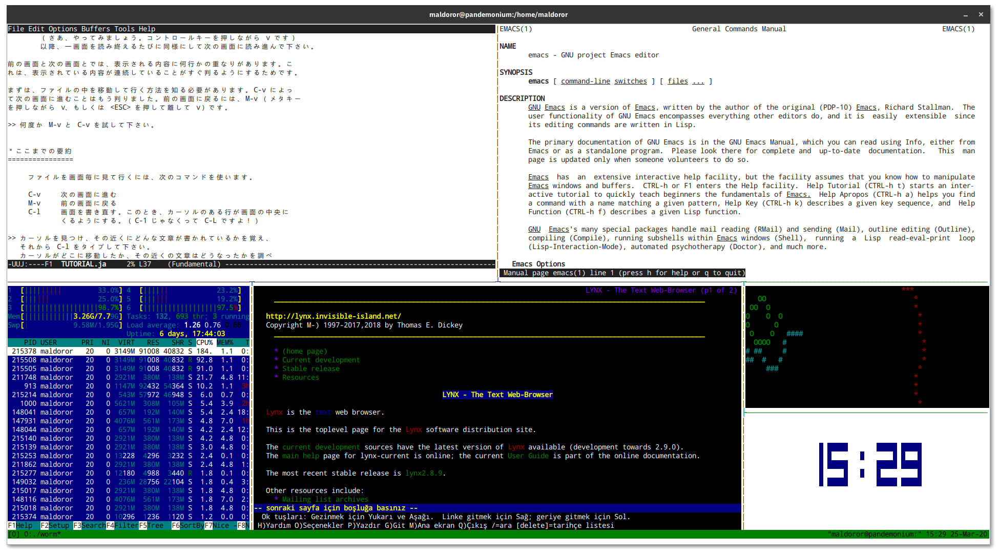

GNUPlot with sixel support, running on the basic terminal example. (Linux)
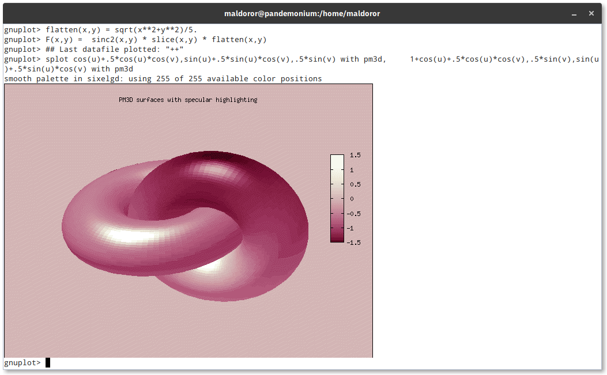

Lynx web browser running on the basic terminal example. (Linux)


Hyperlinks support (via OSC 8) on basic terminal example. (Linux)


Drag and drop animation for inline images in action, on the basic terminal example (Linux)


---	
### Ssh Terminal Example
This example demonstrates the basic interaction between the Terminal and SshShell classes. Thus, it is also illustrating the first point put forth in the *Highlights* section above, since the SSH package of Ultimate++ can run on Windows, Linux, and MacOS.

Creating an xterm-compatible virtual SSH terminal with inline images and mouse tracking support requires only 43 sLoC:

```C++
#include <Core/Core.h>
#include <Core/SSH/SSH.h>
#include <Terminal/Terminal.h>

using namespace Upp;

String url = "demo:password@test.rebex.net:22";	// A well-known public SSH test server.

struct SshTerminal : Terminal, SshShell {
	SshTerminal(SshSession& session) : SshShell(session)
	{
		SshShell::Timeout(Null);
		SshShell::ChunkSize(65536);
		SshShell::WhenOutput = [=](const void *data, int size) { Terminal::Write(data, size); };
		Terminal::WhenOutput = [=](String data) { SshShell::Send(data); };
		Terminal::WhenResize = [=]() { SshShell::PageSize(Terminal::GetPageSize()); };
		Terminal::InlineImages().Hyperlinks().WindowOps();		
	}

	void Run(const String& termtype)
	{
		SshShell::Run(termtype, Terminal::GetPageSize());
		if(SshShell::IsError())
			ErrorOK(DeQtf(GetErrorDesc()));
	}
};

struct SshTerminalExample : TopWindow {
	void Run()
	{
		if(!EditTextNotNull(url, "SSH server", "Url"))
			return;
		SshSession session;
		session.WhenWait = [=]{ ProcessEvents(); };
		if(!session.Timeout(10000).Connect(url)) {
			ErrorOK(DeQtf(session.GetErrorDesc()));
			return;
		}
		SshTerminal term(session);
		SetRect(term.GetStdSize()); // 80 x 24 cells (scaled)
		Sizeable().Zoomable().CenterScreen().Add(term.SizePos());
		OpenMain();
		term.Run("xterm");
	}
};

GUI_APP_MAIN
{
	SshTerminalExample().Run();
}
```
#### Screenshots
Jexer with sixel support, running on the ssh terminal example. (Windows)
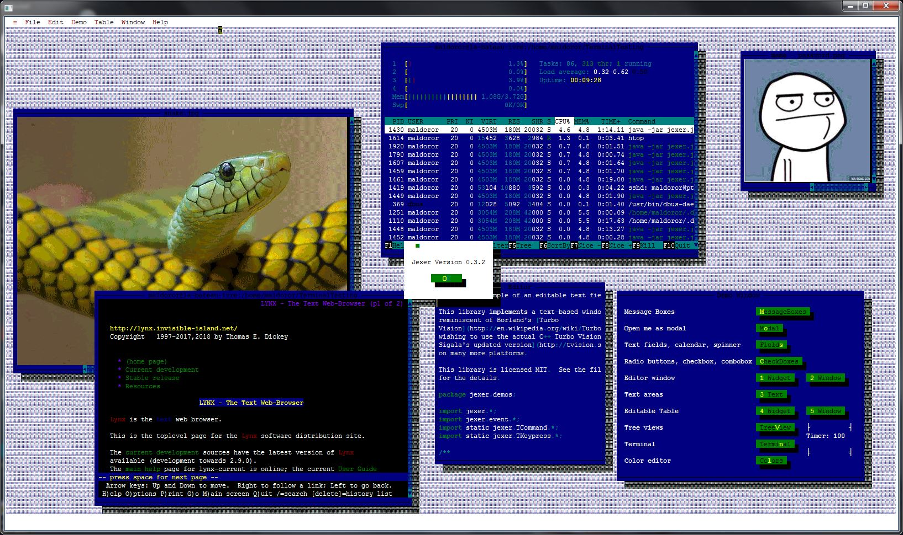

On the left is PuTTY and on the right is the ssh terminal example (Windows):
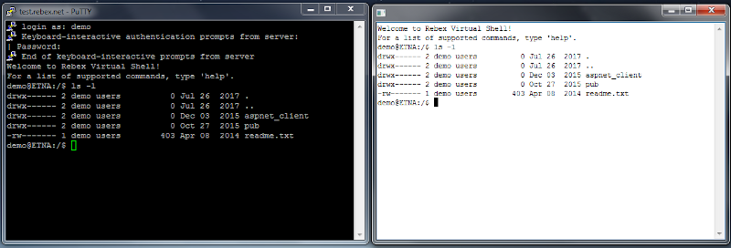

---
### Terminal in a Web Browser Example

Now some cool stuff.

Ultimate++ has a package named "Turtle", which allows any U++ GUI application to be accessed via a web browser that supports websockets and HTML-5 canvas. It is basically an HTML-5 backend for GUI apps. To demonstrate this point, let's use the source code of the basic terminal example above. A few lines of extra code will turn it into a remote terminal that can be accessed via any decent web browser, such as Firefox or Chromium!

```C++
#include <Terminal/Terminal.h>
#include <Terminal/PtyProcess.h>

using namespace Upp;

const char *nixshell = "/bin/bash";

struct TerminalExample : TopWindow {
	Terminal term;
	PtyProcess pty;
	
	TerminalExample()
	{
		SetRect(term.GetStdSize());	// 80 x 24 cells (scaled).
		Sizeable().Zoomable().CenterScreen().Add(term.SizePos());
		term.WhenBell   = [=]()         { BeepExclamation(); };
		term.WhenTitle  = [=](String s) { Title(s);          };
		term.WhenOutput = [=](String s) { pty.Write(s);      };
		term.WhenResize = [=]()         { pty.SetSize(term.GetPageSize()); };
		term.InlineImages().Hyperlinks().WindowOps();
		pty.Start(nixshell, Environment(), GetHomeDirectory());
		SetTimeCallback(-1, [=] ()
		{
			term.WriteUtf8(pty.Get());
			 if(!pty.IsRunning())
				Break();
		});
	}
};

void Main()
{
	TerminalExample().Run();
}

#ifdef flagTURTLE
CONSOLE_APP_MAIN
{
	StdLogSetup(LOG_COUT|LOG_FILE);

	MemoryLimitKb(100000000);
	Ctrl::host = "localhost";
	Ctrl::port = 8888;
	Ctrl::connection_limit = 15; // Maximum number of concurrent users (preventing DDoS)

#ifdef _DEBUG
	Ctrl::debugmode = true;      // Only single session in debug (no forking)
#endif
	if(Ctrl::StartSession()) {
		Main();
		Ctrl::EndSession();
	}
	LOG("Session Finished");
}
#else
GUI_APP_MAIN
{
	Main();
}
#endif
```
#### Screenshots
Jexer with sixel support, running on the terminal example compiled with the TURTLE flag. (Accessed via Firefox)
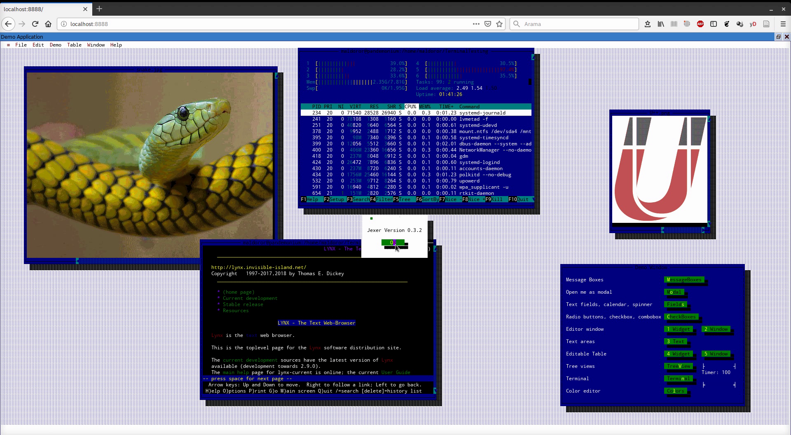


### Terminal Splitter Example

As it is already mentioned in the *Highlights* section, Terminal ctrl is a regular widget, i.e it is not much different from other UI elements such as buttons, treeviews, lists, arrays, color pickers, etc., albeit a more complex one. It follows the ingenious design of the Ultimate++ widget library as closely as possible.

Below two example illustrate a way of creating more advanced user interfaces with the Terminal package, simply by using a splitter widget. A splitter is a container widget that can be used to split any parent widget into resizable horizontal or vertical panes. The second terminal splitter example is basically a variant of the first one except that it has the same extra code as in basic terminal example above, and runs on the Turtle HTML-5 backend:

(Note that you can also use tabs *instead of/with* splitters: A tabbed terminals example is also provided with package.)

```C++
#include <Terminal/Terminal.h>
#include <Terminal/PtyProcess.h>

// This  example  demonstrates a  simple terminal  splitter.
// It uses PtyProcess, therefore it is currently POSIX-only.

const char *nixshell = "/bin/bash";
const int  MAXPANECOUNT = 4;  // You can increase the number of panes if you like.

using namespace Upp;

struct TerminalPane : Terminal, PtyProcess {
	Splitter& parent;
	TerminalPane(Splitter& ctrl) : parent(ctrl)
	{
		Terminal::InlineImages().Hyperlinks().WindowOps();
		Terminal::WhenBell   = [=]()         { BeepExclamation();    };
		Terminal::WhenOutput = [=](String s) { PtyProcess::Write(s); };
		Terminal::WhenResize = [=]()         { PtyProcess::SetSize(GetPageSize()); };
		PtyProcess::Start(nixshell, Environment(), GetHomeDirectory());	// Defaults to TERM=xterm
		parent.Add(Terminal::SizePos());
	}
	
	void Do()
	{
		Terminal::WriteUtf8(PtyProcess::Get());
		if(!PtyProcess::IsRunning()) {
			parent.Remove(*this);
			parent.Layout();
		}
	}
	
	bool Key(dword key, int count) override
	{
		// Let the parent handle the SHIFT + CTRL + T key.
		return key != K_SHIFT_CTRL_T ? Terminal::Key(key, count) : false;
	}
};

struct TerminalSplitterExample : TopWindow {
	Splitter splitter;
	Array<TerminalPane> panes;
	
	bool Key(dword key, int count) override
	{
		if(key == K_SHIFT_CTRL_T) AddPane();
		return false;
	}

	void AddPane()
	{
		if(splitter.GetCount() < MAXPANECOUNT)
			panes.Create<TerminalPane>(splitter);
	}

	void Run()
	{
		Title(t_("Terminal splitter (Press CTRL + SHIFT + T to split the view)"));
		Sizeable().Zoomable().CenterScreen().SetRect(0, 0,  1024, 600);
		Add(splitter.Horz());
		AddPane();
		OpenMain();
		while(IsOpen() && splitter.GetCount()) {
			ProcessEvents();
			for(TerminalPane& pane : panes) pane.Do();
			Sleep(10);
		}
	}
};

GUI_APP_MAIN
{
	TerminalSplitterExample().Run();
}
```
#### Screenshots

On the left is htop, and on the right is GNU nano running simultaneously on the terminal splitter example. (Linux)
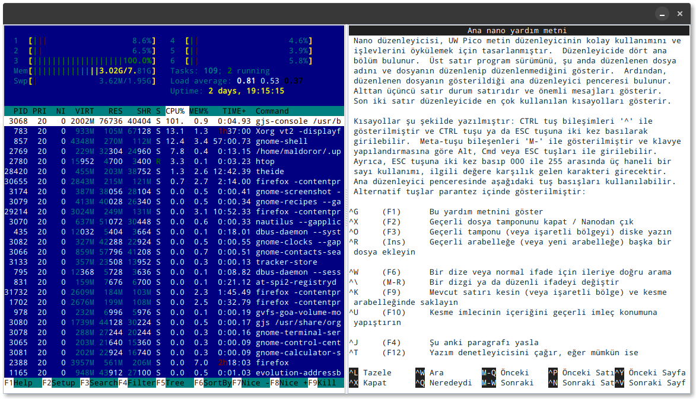

The same terminal splitter example compiled with Ultimate++'s Turtle HTML-5 backend. (Accessed via Firefox)

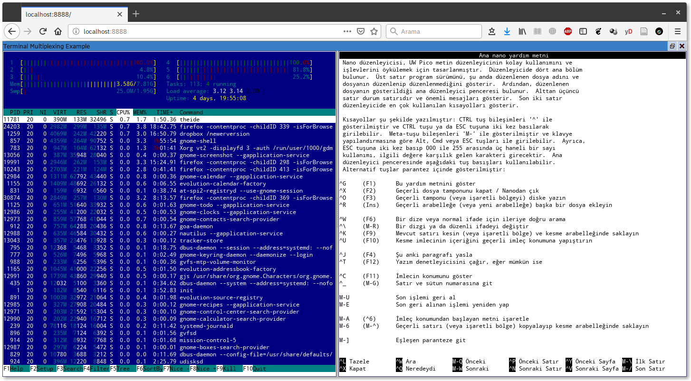

Rectangle selection, and programmable right mouse button (context) menu in action, on the terminal splitter example. (Linux)

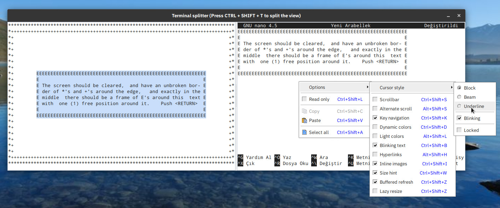

### Ssh Terminal Splitter Example
Given the flexiblity and power of Ultimate++, it is easy to modify the above splitter example, so that it can be used as a relatively fancy front-end for SSH2 shells. This example is cross-platform, and demonstrates the interaction between the Terminal widget and the Ultimate++'s Core/SSH package, in a multithreaded environment. 

```C++
#include <Core/SSH/SSH.h>
#include <Terminal/Terminal.h>

// This example demonstrates a multithreaded ssh terminal splitter
// It is using the  Core/SSH package, therefore it can be compiled
// for, and run on, Windows and  POSIX-compliant operating systems.

using namespace Upp;

String url = "demo:password@test.rebex.net:22";	// A well-known public SSH test server.

const int MAXPANECOUNT = 4; // You can increase the number of panes if you like.

struct SshTerminalPane : Terminal, SshShell {
	Splitter& parent;
	SshTerminalPane(SshSession& session, Splitter& ctrl) : SshShell(session), parent(ctrl)
	{
		SshShell::Timeout(Null);
		SshShell::ChunkSize(65536);
		SshShell::WhenOutput = [=](const void *data, int size) { GuiLock __; Terminal::Write(data, size);     };
		SshShell::WhenWait   = [=]()                           { if(CoWork::IsCanceled()) SshShell::Abort();  };
		Terminal::WhenOutput = [=](String data)                { SshShell::Send(data);                        };
		Terminal::WhenResize = [=]()                           { SshShell::PageSize(Terminal::GetPageSize()); };
		Terminal::InlineImages().Hyperlinks().WindowOps();
		parent.Add(Terminal::SizePos());
	}
	
	void Run(const String& termtype)
	{
		SshShell::Run(termtype, Terminal::GetPageSize());
		GuiLock __;
		parent.Remove(*this);
		parent.Layout();
	}

	bool Key(dword key, int count) override
	{
		// Let the parent handle the SHIFT + CTRL + T key.
		return key != K_SHIFT_CTRL_T ? Terminal::Key(key, count) : false;
	}
};

struct SshTerminalSplitterExample : TopWindow {
	Splitter   splitter;
	SshSession session;
	CoWorkNX   workers; // Same as CoWork, but can be used as a member.

	bool Key(dword key, int count) override
	{
		if(key == K_SHIFT_CTRL_T) AddPane();
		return false;
	}

	void AddPane()
	{
		if(splitter.GetCount() < MAXPANECOUNT) {
			workers & [=] {
				EnterGuiMutex();                            // Note: Ctrl derived classes can only be
				SshTerminalPane shell(session, splitter);   // initialized in main thread OR vith gui
				LeaveGuiMutex();                            // mutex. (GuiLock)
				shell.Run("xterm");
			};
		}
	}

	void Run()
	{
		if(!EditTextNotNull(url, "SSH server", "Url"))
			Exit(1);

		session.WhenWait = [=] { if(IsMainThread()) ProcessEvents(); };

		if(!session.Timeout(10000).Connect(url)) {
			ErrorOK(DeQtf(session.GetErrorDesc()));
			Exit(1);
		}

		Title(t_("Ssh terminal splitter (Press CTRL + SHIFT + T to split the view)"));
		Sizeable().Zoomable().CenterScreen().SetRect(0, 0,  1024, 600);
		Add(splitter.Horz());
		AddPane();
		OpenMain();
		while(IsOpen() && !workers.IsFinished()) {
			ProcessEvents();
			Sleep(10);
		}
		GuiUnlock __;
		workers.Cancel();
	}
};

GUI_APP_MAIN
{
	SshTerminalSplitterExample().Run();
}
```
#### Screenshots
From left to right: Jexer, htop, GNU nano, ncurses examples (worm, tclock), running simultaneously on the ssh terminal splitter example. (Windows)
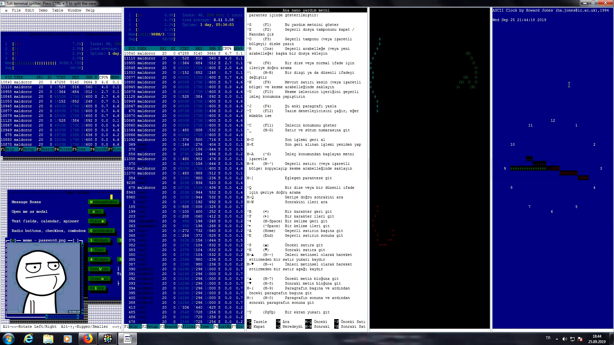

## [To Do](#todo)
There is always room for improvement and new features.

- Implement the remaining useful DEC, ANSI, and xterm sequences and modes.
- Encapsulate the Windows power-shell process in PtyProcess.
- Improve key handling on Windows.
- Improve legacy charsets support.
- DEC locator support.
- xterm style rectangular area checksum reports.
- BIDI support.
- Write a terminfo file
- Improve API documentation.
 
## [Known Issues](#issues)

Nothing is perfect and Terminal package is no exception. Known major issues are listed below.

- Function keys and editor keys are not handled properly on some notebooks.
- Image zoom in and out keys are not working with jexer (v0.3.2)

## [Version](#version)

Terminal package is currently at v0.3. (It is considered a beta until v1.0)

## [Acknowledgements](#acknowledgements)

*Note that below list is incomplete and to be written...*
- vttest, and other test scripts written for xterm are extensively used in testing of the Terminal ctrl. (Thanks [@Thomas E. Dickey](https://invisible-island.net/home.html)!)
- ncurses, its demos and tests are also used in developing the Terminal package.
- [esctest](https://gitlab.com/gnachman/iterm2/-/tree/61660349070fd4c75d1dbf333db0aabf2456c938/tests/esctest) test suite, automatic unit tests for terminal emulation, is heavily used in testing of Terminal ctrl. (Thanks [@George Nachman](https://github.com/gnachman)!)

- [Jexer](https://jexer.sourceforge.io/), a modern text user interface (TUI) and window manager for terminal emulators, is heavily used as a test-bed for polishing the inline images support for the v0.2 of Terminal ctrl. And hopefully it will continue to be a test bed for future versions of the Terminal package. (Thanks [@Kevin Lamonte](https://gitlab.com/klamonte)!)

- img2sixel of [libsixel](https://github.com/saitoha/libsixel/) is used heavily for testing the sixel images support of Terminal ctrl.
 
## [License](#license)

	Copyright (c) 2019-2020, İsmail Yılmaz
	All rights reserved.

	Redistribution and use in source and binary forms, with or without
	modification, are permitted provided that the following conditions are met:

	* Redistributions of source code must retain the above copyright notice, this
	  list of conditions and the following disclaimer.

	* Redistributions in binary form must reproduce the above copyright notice,
	  this list of conditions and the following disclaimer in the documentation
	  and/or other materials provided with the distribution.

	* Neither the name of the copyright holder nor the names of its
	  contributors may be used to endorse or promote products derived from
	  this software without specific prior written permission.

	THIS SOFTWARE IS PROVIDED BY THE COPYRIGHT HOLDERS AND CONTRIBUTORS "AS IS"
	AND ANY EXPRESS OR IMPLIED WARRANTIES, INCLUDING, BUT NOT LIMITED TO, THE
	IMPLIED WARRANTIES OF MERCHANTABILITY AND FITNESS FOR A PARTICULAR PURPOSE ARE
	DISCLAIMED. IN NO EVENT SHALL THE COPYRIGHT HOLDER OR CONTRIBUTORS BE LIABLE
	FOR ANY DIRECT, INDIRECT, INCIDENTAL, SPECIAL, EXEMPLARY, OR CONSEQUENTIAL
	DAMAGES (INCLUDING, BUT NOT LIMITED TO, PROCUREMENT OF SUBSTITUTE GOODS OR
	SERVICES; LOSS OF USE, DATA, OR PROFITS; OR BUSINESS INTERRUPTION) HOWEVER
	CAUSED AND ON ANY THEORY OF LIABILITY, WHETHER IN CONTRACT, STRICT LIABILITY,
	OR TORT (INCLUDING NEGLIGENCE OR OTHERWISE) ARISING IN ANY WAY OUT OF THE USE
	OF THIS SOFTWARE, EVEN IF ADVISED OF THE POSSIBILITY OF SUCH DAMAGE.
